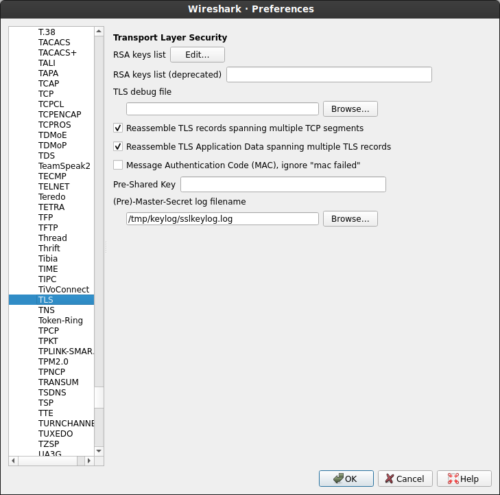
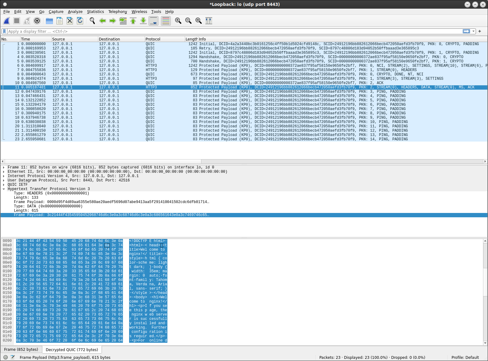

# QUIC HTTP/3 with nginx, envoy and curl

Basic set of `Dockerfile` definitions which demonstrate [HTTP3+QUIC](https://en.wikipedia.org/wiki/QUIC) with `nginx`, `envoy` and `curl`.

Why enclose this in a dockerfile?  well, its not yet (as of writing) in a main release channel yet for either nginx or curl (envoy is a different story)

What this does is basically allows you to run nginx (or envoy) and curl together over `http3+quic`.  You can capture, alter or change settings on nginx to test out the various features described in the RFC's below that are supported in nginx and curl.


For background information on `quic`, see

- [Introducing a Technology Preview of NGINX Support for QUIC and HTTP/3](https://www.nginx.com/blog/introducing-technology-preview-nginx-support-for-quic-http-3/)
- [draft-ietf-quic-http-23](https://datatracker.ietf.org/doc/html/draft-ietf-quic-http-23)
- [nginx-quic](https://quic.nginx.org/)
- [curl http3 quic](https://github.com/curl/curl/blob/master/docs/HTTP3.md)

Also see [Decrypting TLS, HTTP/2 and QUIC with Wireshark](https://www.youtube.com/watch?v=yodDbgoCnLM)


- [Build Nginx](#build-nginx)
- [Build curl](#build-curl)
- [Nginx HTTP3 request (nginx)](#nginx-http3-request)
- [Envoy request (envoy)](#envoy-http3-request)
- [Decoding QUIC](#decoding-quic)

### Build nginx

First build the docker images on your own or just use the provided image here (`docker.io/salrashid123/nginx-http3`)

```bash
docker build -t salrashid123/nginx-http3 -f Dockerfile.nginx .
```

(TODO: make the image smaller...but this is fine for a demo)


### Build curl

Now build `curl` with http3 support or use the provided image here (`docker.io/salrashid123/curl-http3`)

```
docker build -t salrashid123/curl-http3 -f Dockerfile.curl .
```

### nginx HTTP3 request

Now start the nginx container:

```bash
docker run -v `pwd`/logs:/apps/http3/nginx/logs --net=host -p 8443:8443 -t salrashid123/nginx-http3
```

Note, nginx access logs will be written in the appropriately named `logs/` folder


Run curl:

```bash
# optionally capture the keys
mkdir -p /tmp/keylog

docker run --net=host -v`pwd`/config/:/certs -v /tmp/keylog/:/tmp/keylog -e SSLKEYLOGFILE=/tmp/keylog/sslkeylog.log \
    -t salrashid123/curl-http3 \
   -vvv --cacert certs/tls-ca-chain.pem  \
   --resolve  localhost.esodemoapp2.com:8443:127.0.0.1 --http3 https://localhost.esodemoapp2.com:8443/


* Added localhost.esodemoapp2.com:8443:127.0.0.1 to DNS cache
* Hostname localhost.esodemoapp2.com was found in DNS cache
*   Trying 127.0.0.1:8443...
* Connect socket 6 over QUIC to 127.0.0.1:8443
* Connected to localhost.esodemoapp2.com () port 8443 (#0)
* Using HTTP/3 Stream ID: 0 (easy handle 0x564489214f60)
> GET / HTTP/3
> Host: localhost.esodemoapp2.com:8443
> user-agent: curl/7.81.0-DEV
> accept: */*
> 
* ngh3_stream_recv returns 0 bytes and EAGAIN
< HTTP/3 200 
< server: nginx/1.21.5
< date: Mon, 27 Dec 2021 13:59:16 GMT
< content-type: text/html
< content-length: 615
< last-modified: Sun, 26 Dec 2021 21:26:33 GMT
< etag: "61c8de09-267"
< alt-svc: h3=":8443"; ma=86400
< accept-ranges: bytes
< 
<!DOCTYPE html>
<html>
<head>
<title>Welcome to nginx!</title>
<style>
html { color-scheme: light dark; }
body { width: 35em; margin: 0 auto;
font-family: Tahoma, Verdana, Arial, sans-serif; }
</style>
</head>
<body>
<h1>Welcome to nginx!</h1>
<p>If you see this page, the nginx web server is successfully installed and
working. Further configuration is required.</p>

<p>For online documentation and support please refer to
<a href="http://nginx.org/">nginx.org</a>.<br/>
Commercial support is available at
<a href="http://nginx.com/">nginx.com</a>.</p>

<p><em>Thank you for using nginx.</em></p>
</body>
</html>
* Connection #0 to host localhost.esodemoapp2.com left intact
```

Notice that curl is using quic 

```bash
* Connect socket 6 over QUIC to 127.0.0.1:8443
* Connected to localhost.esodemoapp2.com () port 8443 (#0)
* Using HTTP/3 Stream ID: 0 (easy handle 0x564489214f60)
> GET / HTTP/3
> Host: localhost.esodemoapp2.com:8443
> user-agent: curl/7.81.0-DEV
> accept: */*
```

### Envoy HTTP3 request

Not surprisingly, `Envoy` already supports quic:

- [QUIC listener config](https://www.envoyproxy.io/docs/envoy/latest/api-v3/config/listener/v3/quic_config.proto)

Configuring a listener was pretty challenging to get the specific protobuf envoy yaml expects.  As with just about everything, someone else ([lkpdn@](https://github.com/lkpdn)) [already the the heavy lifting](https://gist.github.com/lkpdn/170fac3ab5bbea3409ca79e58123f697)...i just used that sample.

Anyway, first get an envoy binary.  I usually just extract it locally on linux

```bash
docker cp `docker create envoyproxy/envoy-dev:latest`:/usr/local/bin/envoy .
```

Then run envoy in debug mode (remember to stop nginx container, if its still running)

```bash
/tmp/envoy -c envoy.yaml -l debug
```

This will also listen on udp `:8443` so you can use the same curl command:


```bash
$  docker run --net=host -v`pwd`/config/:/certs -v /tmp/keylog/:/tmp/keylog \
   -e SSLKEYLOGFILE=/tmp/keylog/sslkeylog.log     -t salrashid123/curl-http3   \
   -vvv --cacert certs/tls-ca-chain.pem   \
   --resolve  localhost.esodemoapp2.com:8443:127.0.0.1 \
   --http3 https://localhost.esodemoapp2.com:8443/

* Added localhost.esodemoapp2.com:8443:127.0.0.1 to DNS cache
* Hostname localhost.esodemoapp2.com was found in DNS cache
*   Trying 127.0.0.1:8443...
* Connect socket 6 over QUIC to 127.0.0.1:8443
* Connected to localhost.esodemoapp2.com () port 8443 (#0)
* Using HTTP/3 Stream ID: 0 (easy handle 0x556f134d0f60)
> GET / HTTP/3
> Host: localhost.esodemoapp2.com:8443
> user-agent: curl/7.81.0-DEV
> accept: */*
> 
* ngh3_stream_recv returns 0 bytes and EAGAIN
< HTTP/3 200 
< content-length: 2
< content-type: text/plain
< date: Mon, 27 Dec 2021 14:55:29 GMT
< server: envoy
< 
* Connection #0 to host localhost.esodemoapp2.com left intact

ok
```

The envoy logs will show the full capture

```log
21-12-27 09:55:26.099][674972][debug][config] [source/server/listener_impl.cc:743] add active listener: name=listener_udp, hash=12775932757126651534, address=0.0.0.0:8443


[2021-12-27 09:55:29.718][674979][debug][quic_stream] [source/common/quic/envoy_quic_server_stream.cc:160] [C5477787520329841858][S0] Received headers: { :method=GET, :path=/, :scheme=https, :authority=localhost.esodemoapp2.com:8443, user-agent=curl/7.81.0-DEV, accept=*/*, }.
[2021-12-27 09:55:29.718][674979][debug][http] [source/common/http/conn_manager_impl.cc:867] [C5477787520329841858][S8968662946347409001] request headers complete (end_stream=false):
':method', 'GET'
':path', '/'
':scheme', 'https'
':authority', 'localhost.esodemoapp2.com:8443'
'user-agent', 'curl/7.81.0-DEV'
'accept', '*/*'

[2021-12-27 09:55:29.718][674979][debug][http] [source/common/http/filter_manager.cc:947] [C5477787520329841858][S8968662946347409001] Sending local reply with details direct_response
[2021-12-27 09:55:29.718][674979][debug][http] [source/common/http/conn_manager_impl.cc:1467] [C5477787520329841858][S8968662946347409001] encoding headers via codec (end_stream=false):
':status', '200'
'content-length', '2'
'content-type', 'text/plain'
'date', 'Mon, 27 Dec 2021 14:55:29 GMT'
'server', 'envoy'

[2021-12-27 09:55:29.718][674979][debug][quic_stream] [source/common/quic/envoy_quic_server_stream.cc:59] [C5477787520329841858][S0] encodeHeaders (end_stream=false) ':status', '200'
'content-length', '2'
'content-type', 'text/plain'
'date', 'Mon, 27 Dec 2021 14:55:29 GMT'
'server', 'envoy'
.
[2021-12-27 09:55:29.718][674979][debug][quic_stream] [source/common/quic/envoy_quic_server_stream.cc:71] [C5477787520329841858][S0] encodeData (end_stream=true) of 2 bytes.
[2021-12-27 09:55:29.719][674979][debug][http] [source/common/http/conn_manager_impl.cc:204] [C5477787520329841858][S8968662946347409001] doEndStream() resetting stream
[2021-12-27 09:55:29.719][674979][debug][http] [source/common/http/conn_manager_impl.cc:1517] [C5477787520329841858][S8968662946347409001] stream reset
```


### Decoding QUIC

The `example/` folder contains a sample curl-to-nginx trace capture with [sslkeylogging`](https://developer.mozilla.org/en-US/docs/Mozilla/Projects/NSS/Key_Log_Format) enabled.  You can use it within wireshark to decode the http3/quic traffic and understand the layers.

To use this, first set the keylog file first to the folder 



Then copy the keylog to the folder or wireshark to use:

```bsh
$ mkdir /tmp/keylog
$ cp example/sslkeylog.log /tmp/keylog/sslkeylog.log 
$ wireshark example/wireshark.pcapng 
```

then after loading the pcap file, you should see the full trace


#### TODO

Use [qpack decoder in go](https://github.com/marten-seemann/qpack) to see the actual protocol


### References

More references:

- [Using Wireshark to decrypt TLS gRPC Client-Server protobuf messages](https://blog.salrashid.dev/articles/2021/wireshark-grpc-tls/)
- [OpenSSL 3.0.0 docker with TLS trace enabled](https://blog.salrashid.dev/articles/2021/openssl_fips/)
